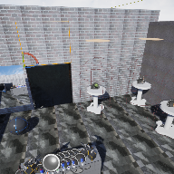

# Project Name  VRMod11Sample

## Description

A continuation of the in class demonstration code based on UE default Virtual Reality template. Added MyGameInstance, BP_Pedestal(s), and customized WidgetMenu.
 
## Usage
Clone, or download the zip, to a local directory. Open in Unreal Engine 5.4 or newer

## Attributions

